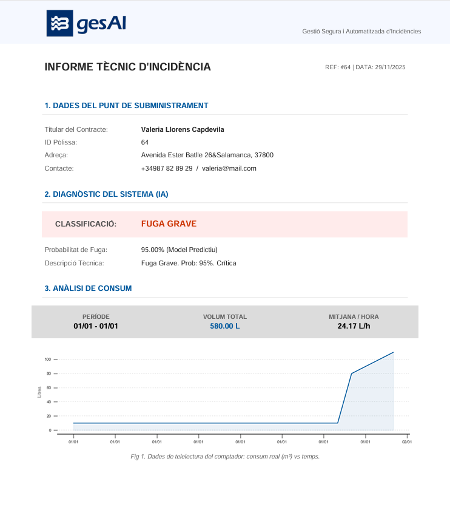
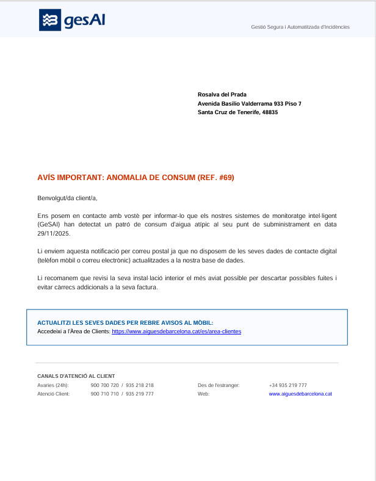

# GeSAI: Gestió Segura i Automatitzada d'Incidències
> **Aigües de Barcelona Data Challenge** | Team GeSAI | UPF

**GeSAI** es una plataforma integral para la detección temprana y gestión de fugas de agua. Combina un modelo de **Inteligencia Artificial (LightGBM)** entrenado con más de 75 millones de registros para predecir anomalías, con un sistema de **Meta-Análisis** que prioriza la gravedad según la tendencia futura.

El sistema destaca por su enfoque híbrido en la comunicación: notificaciones digitales automáticas y generación de **cartas postales físicas** para clientes afectados por la brecha digital.

# Estructura del Proyecto

A continuación se detalla la organización de carpetas y archivos del sistema GeSAI:

```text
GeSAI-AB_Data_Challenge/
│
├── .gitignore                  # Archivos y carpetas a excluir del control de versiones (ej. venv, __pycache__)
├── gesai.db                    # Base de datos SQLite principal (Persistencia de incidencias, clientes y usuarios)
├── LICENSE                     # Licencia del proyecto
├── README.md                   # Documentación general del proyecto
├── requirements.txt            # Lista de dependencias Python necesarias (pip install -r requirements.txt)
│
├── .vscode/                    # Configuración del entorno de desarrollo
│   └── settings.json
│
├── data/                       # Almacenamiento de datos (Inputs y Outputs)
│   ├── README.md
│   ├── official-data/          # Datos originales proporcionados por el reto (Raw Data)
│   │   ├── data_ab3_complete.parquet # Dataset oficial del reto (75M+ registros de consumo horario y fugas)
│   │   └── README.md
│   │
│   ├── open-data/              # Fuentes de datos abiertas externas (Enriquecimiento)
│   │   ├── antiguitat_pivotada.csv # Datos de catastro (edad edificios por sección censal)
│   │   ├── data_aemet_1.json       # Histórico meteorológico oficial (Parte 1)
│   │   ├── data_aemet_2.json       # Histórico meteorológico oficial (Parte 2)
│   │   ├── obres_procesadas.csv    # Datos de obras públicas activas en Barcelona
│   │   ├── poblacion_pivotada.csv  # Datos demográficos por sección censal
│   │   ├── renda_procesada.csv     # Datos socioeconómicos (Renta media por barrio)
│   │   └── README.md
│   │
│   └── processed-data/         # Datos procesados y Modelos (Artifacts)
│       ├── dataset_FINAL_COMPLETO/     # Dataset maestro enriquecido y procesado con Dask (formato Parquet)
│       ├── analisis_predicciones.csv   # Resultados del entrenamiento (Probabilidades y Deltas) para análisis
│       ├── datos_simulacion_features.csv # Dataset limpio con features calculadas (Lags/Rolling) para la simulación
│       ├── lgbm_model_TARGET_7DIAS.joblib  # Modelo IA entrenado (Predicción a 7 días vista)
│       ├── lgbm_model_TARGET_HOY.joblib    # Modelo IA entrenado (Predicción inmediata)
│       └── lgbm_model_TARGET_MANANA.joblib # Modelo IA entrenado (Predicción a 24h)
│
├── docs/                       # Documentación adicional sobre la gestión del proyecto
│   └── README.md
│
├── generated_reports/          # Salida de archivos generados por el sistema (PDFs)
│   ├── regular_mails/          # Cartas postales generadas automáticamente para clientes sin contacto digital
│   └── technical_reports/      # Informes técnicos detallados con gráficas para uso interno de la empresa
│
├── project-notebooks/          # Laboratorio de Data Science (Jupyter Notebooks)
│   ├── data-preparation.ipynb          # Notebook 1: ETL distribuido con Dask, limpieza y enriquecimiento de datos
│   ├── model-training.ipynb            # Notebook 2: Entrenamiento LightGBM, optimización de umbrales y exportación
│   ├── prediction-meta-analysis.ipynb  # Notebook 3: Definición de reglas de negocio, deltas y clasificación de gravedad
│   ├── prediction-XAI.ipynb            # Notebook 4: Explicabilidad del modelo (SHAP values) para caja blanca
│   └── README.md
│
└── src/                        # Código Fuente de la Aplicación (Producción)
    ├── app.py                  # Frontend: Dashboard web interactivo para gestores (Dash/Plotly)
    ├── motor_gesai.py          # Core: "Cerebro" del sistema. Orquesta IA, BBDD y reglas de negocio
    ├── reports_manager.py      # Módulo: Generador de PDFs profesionales (Cartas e Informes) con FPDF
    ├── setup_database.py       # Script: Inicialización de BBDD, creación de tablas y seeding de datos realistas
    ├── simulacion_backend.py   # Backend: Worker autónomo que simula la entrada de datos IoT en tiempo real
    ├── test_report.py          # Script de pruebas unitarias para la generación de informes PDF
    ├── __init__.py             # Archivo de inicialización del paquete Python
    │
    └── assets/                 # Recursos estáticos para la interfaz web
        ├── ios_homescreen.jpg  # Recurso gráfico para el marco del simulador móvil
        ├── logo_1.png          # Logo corporativo principal (Versión Login)
        ├── logo_2.png          # Logo corporativo secundario (Versión Header/PDF)
        └── style.css           # Hoja de estilos personalizada (Look & Feel Enterprise)
```

## Arquitectura Técnica

El sistema sigue un patrón de **Microservicios Desacoplados**:

1.  **Capa de Datos (ETL):** Procesamiento distribuido con **Dask** para manejar grandes volúmenes de datos históricos.
2.  **Capa de Inteligencia (AI Core):** Tres modelos **LightGBM** independientes predicen el riesgo a corto, medio y largo plazo.
3.  **Capa de Negocio (Meta-Análisis):** Un motor lógico evalúa los "Deltas" (tendencias de probabilidad) para clasificar la fuga como *Grave*, *Moderada* o *Leve*.
4.  **Capa de Presentación (App):** Interfaz web construida con **Dash/Plotly** que se actualiza en tiempo real mediante lectura de BBDD.

---

## Guía de ejecución (Demo)

Para levantar el entorno completo de simulación en local:

### 1. Instalación de las dependencias requeridas
```bash 
pip install -r requirements.txt
```

### 2. Inicialización de BBDD
Este script crea las tablas y genera 50 clientes sintéticos (mezclando perfiles digitales y analógicos).

```bash 
cd src
python setup_database.py
```

### 3. Ejecución de la simulación
El sistema requiere dos terminales abiertas simultáneamente para simular el flujo real.

TERMINAL 1 (Backend IoT): Simula la llegada de datos de contadores, ejecuta la IA y escribe alertas.
```bash 
python simulacion_backend.py
```

TERMINAL 2 (Frontend Dashboard): Arranca la interfaz visual para el gestor.
```bash 
python app.py
```

### 4. Acceso al MVP
* Panel de Control: Abra http://127.0.0.1:8050/ en su navegador.
* Simulación movil: Abra http://127.0.0.1:8050/sim-movil/ID_CLIENTE (Poliza suministro)
* Credenciales: empresa@gesai.com / 1234


# Challenge Final Report (GeSAI) 
## Índice
## 1. Resumen Ejecutivo (Executive Summary)
* **1.1. Visión General:** Qué es GeSAI y qué problema resuelve (Detección proactiva + Inclusión social).
* **1.2. Cifras Clave:** Resumen de impacto (84% Precisión, 68% Reducción de Falsas Alarmas, 100% Cobertura de Clientes).
* **1.3. Valor Diferencial:** La combinación de IA avanzada con un canal de comunicación híbrido (Digital/Analógico).

## 2. Contexto y Definición del Problema (Background)
* **2.1. El Reto del AB Data Challenge:** Descripción del ámbito "Detección de consumos anómalos" y "Experiencia de cliente".
* **2.2. Problemática Detectada:**
    * Ineficiencia operativa por falsas alarmas.
    * Riesgo de exclusión para colectivos vulnerables (Brecha Digital).
* **2.3. Validación de Mercado (Estudio Inicial):**
    * Resultados de la encuesta ciudadana (N=100+).
    * Evidencia de la necesidad del canal postal (Datos sobre gestión de suministros para mayores).
    * Nivel de aceptación de la IA en la gestión del agua.

## 3. Solución Propuesta y Objetivos
* **3.1. Descripción del Producto (MVP):** Sistema integral de monitorización, detección y notificación multicanal.
* **3.2. Objetivos del Proyecto:**
    * **Negocio:** Optimización de recursos y reducción de costes operativos.
    * **Social:** Garantizar que la alerta llegue a todos, independientemente de su tecnología.
    * **Técnico:** Procesamiento escalable de Big Data en tiempo real.

## 4. Metodología Técnica: De los Datos al Modelo
* **4.1. Ingeniería de Datos (Data Engineering):**
    * Fuentes de Datos: Dataset Oficial (75M registros) + Open Data (AEMET, Catastro).
    * Estrategia Big Data: Procesamiento distribuido con Dask para superar limitaciones de memoria.
    * **Creación de Nuevos Datos (Feature Engineering):** Desarrollo de variables sintéticas (Lags, Rolling Windows, Ratios de Desviación) para capturar la temporalidad.
* **4.2. Modelado Predictivo (The AI Core):**
    * **Selección del Modelo:** Justificación del cambio de LSTM a LightGBM (Eficiencia vs. Coste computacional).
    * Estrategia de Entrenamiento: Clasificación Multi-Horizonte (Modelos a 1h, 24h y 7 días).
    * Optimización: Búsqueda de umbral óptimo (Threshold Tuning) para maximizar el F1-Score.
* **4.3. Meta-Análisis de Decisiones:**
    * Lógica de Negocio: Implementación de reglas basadas en "Deltas" (Tendencias de probabilidad) para clasificar la gravedad.
* **4.4. Resultados y Validación:**
    * Métricas finales: AUC-PR (0.86), Precisión (84%).
    * Explicabilidad (XAI): Análisis SHAP para entender los factores de riesgo.

## 5. Arquitectura del Sistema y Visualización (MVP)
* **5.1. Arquitectura de Microservicios:**
    * Diseño desacoplado: Backend Worker (Simulación IoT) vs. Frontend Dashboard (Visualización).
    * Persistencia: Base de datos centralizada (SQLite).
* **5.2. Flujo de Funcionamiento (End-to-End):**
    * Explicación del ciclo de vida del dato: Sensor -> Inferencia IA -> BBDD -> Alerta.
* **5.3. Interfaces de Usuario:**
    * **Dashboard de Empresa:** Panel de control en tiempo real para gestores.
    * **Simulador Móvil:** Experiencia del cliente digital (Notificación Push + Encuesta).
    * **Generador de Reportes:** Automatización de Informes Técnicos y Cartas Postales (PDF).

## 6. Innovación e Impacto (Justificación)
* **6.1. Impacto Social (Brecha Digital):** Detalle de la solución de Cartas Postales Automatizadas para clientes "incontactables".
* **6.2. Eficiencia Operativa:** Estimación de ahorro de costes por filtrado de falsas alarmas.
* **6.3. Cambio de Paradigma:** Transición de un modelo reactivo a uno predictivo basado en tendencias de crecimiento.

## 7. Gestión del Proyecto (Project Management)
* **7.1. Metodología:** Aplicación híbrida PM²/Agile (Iteraciones).
* **7.2. Retos y Soluciones:** Cómo se superó el bloqueo de memoria RAM (MemoryError) mediante reingeniería de datos.
* **7.3. Asunciones y Restricciones:** Limitaciones de hardware y disponibilidad de datos históricos.

## 8. Conclusiones y Próximos Pasos
* **8.1. Conclusiones:** Validación de la viabilidad técnica y comercial del MVP.
* **8.2. Roadmap Futuro (Next Steps):**
    * Implementación de Ciberseguridad (Hashing y Firma Digital en reportes).
    * Despliegue en Cloud (AWS/Azure).
    * Integración con sistemas de facturación reales.

## 9. Anexos
* **9.1. Stack Tecnológico:** Lista de librerías y herramientas.
* **9.2. Enlace al Repositorio:** Código fuente.
* **9.3. Guía Rápida de Uso:** Instrucciones para ejecutar la simulación.


## 1. Resumen Ejecutivo (Executive Summary)
* **1.1. Visión General:** Qué es GeSAI y qué problema resuelve (Detección proactiva + Inclusión social).
* **1.2. Cifras Clave:** Resumen de impacto (84% Precisión, 68% Reducción de Falsas Alarmas, 100% Cobertura de Clientes).
* **1.3. Valor Diferencial:** La combinación de IA avanzada con un canal de comunicación híbrido (Digital/Analógico).

## 2. Contexto y Definición del Problema (Background)
* **2.1. El Reto del AB Data Challenge:**
* 
Challenge 3: **Fugas de agua y experiencia del cliente**

La gestión eficiente de las fugas de agua representa un desafío fundamental que impacta directamente en la experiencia de los clientes.

Cada incidente presenta características particulares que se reflejan en los patrones de consumo y generan diferentes respuestas por parte de los usuarios.

Este desafío busca profundizar en la comprensión de las tipologías de fugas y su relación con la experiencia del cliente, desde su detección hasta la resolución. 
El objetivo es evolucionar hacia una gestión más eficiente y proactiva de estas incidencias, mejorando tanto la conservación de los recursos hídricos como la satisfacción de los usuarios.

* **2.2. Problemática Detectada:**
  
En la actualidad, la empresa Aigües de Barcelona y otras empresas encargadas de la gestión del agua comparten unos antecedentes similares: 

- Detección y/o gestión ineficiente de las fugas de agua u otras anomalías relacionadas con el consumo.
- Comunicación poco satisfactoria debida a una baja fluidez o eficacia a través de alertas no optimizadas en términos de tiempo y cercanía con el cliente.
- Dependencia del CRM de usuarios: A la hora de comunicarse con el cliente cuando se detecta una fuga, el usuario debe estar registrado en el Área de usuarios de Aigües de Barcelona.

Estos antecedentes repercuten directamente en la sostenibilidad debido a la pérdida de recursos hídricos así como en la experiencia de los clientes con la empresa, en términos de confianza y satisfacción y ponen en manifiesto los retos y necesidades a los que se enfrentan este tipo de empresas. Por una parte, destacamos la necesidad de mejora en la detección y gestión de forma eficiente de las fugas de agua así como cualquier consumo anómalo en el consumo. Por otra parte, lograr una comunicación transparente, fluida, eficaz y cercana con los clientes.
 
* **2.3. Validación de Mercado (Estudio Inicial):**
Antes de desarrollar la solución que se explicará en los siguientes puntos, el equipo GeSAI ha desarrollado un estudio de mercado a través de un sistema de encuestas de Google.
A través de esta metodología hemos podido analizar y comprender cual es el punto de partida de nuestro proyecto, detectar las preocupaciones de los usuarios y la opinión de los mismos sobre la solución GeSAI.

Se puede acceder a la encuesta a través del siguiente enlace: https://forms.gle/hEXmXkqDExmNg1TSA

INSIGHTSSSS???

## 3. Solución Propuesta y Objetivos

* **3.1. Descripción del Producto (MVP):**
  
Para dar solución a las necesidades descritas anteriormente, os presentamos nuestra propuesta de proyecto: GesAI, una innovadora plataforma de gestión automatizada de incidencias a través de agentes inteligentes, especializada en fugas que abarca desde la detección y evaluación de dichas incidencias a través de técnicas basadas en Data Science y Machine Learning; la comunicación efectiva y proactiva con el cliente a través de un sistema de alertas y doble verificación con el objetivo de minimizar los riesgos en términos de sostenibilidad y economía del cliente; la elaboración automatizada de informes y visualizaciones de los resultados obtenidos para cada una de las incidencias. Todo ello enmarcado en un entorno seguro de los datos a través técnicas de ciberseguridad y criptografía basadas en AES en modo Galois/Counter Mode y Firma digital con RSA y padding PSS.

Respecto al mercado objetivo, GesAI se centra en empresas encargadas de la gestión del agua y servicios públicos (Aigües de Barcelona), así como clientes domésticos o industriales con acceso a agua en las inmediaciones de la ciudad de Barcelona, los cuales valoren una comunicación cara, ágil y segura sobre su consumo y reducción de riesgos de incidencias.

Respecto al modelo de negocio, se ha optado por un modelo B2B2C, en el que la empresa implementa nuestra plataforma GesAI con el objetivo de mejorar su eficiencia en la gestión de incidencias así como maximizando la satisfacción del cliente. Para ello, estamos guiando el proyecto para que nuestro MVP sea escalable y se pueda adaptar a cualquier empresa ofreciendo un servicio SaaS modular.


* **3.2. Objetivos del Proyecto:**
  
El principal objetivo del equipo GeSAI es gestionar y desarrollar la plataforma GeSAI con los parámetros definidos del Data Challenge de Aigües de Barcelona, garantizando la máxima eficiencia y rigor en la ejecución. Esta plataforma debe mejorar la gestión de incidencias y la experiencia con el cliente mediante:

- Automatización del flujo de alertas e informes: Este punto se centra en la eficiencia y la toma de decisiones basada en datos, eliminando la intervención humana en las etapas de detección y documentación, ahorrando tiempo y movilidad. 

- Comunicación inmediata y segura entre el cliente y la empresa: Transformar una situación negativa en una situación más transparente y de confianza, siempre bajo rigurosos estándares de seguridad.

- Feedback del cliente para una mejora continua: Este evento cierra el ciclo de gestión de la incidencia y asegura que el sistema GeSAI no se quede estático, sino que aprenda y evolucione con cada interacción. Así mismo se implementa una doble verificación de la incidencia por parte del cliente y una guía de actuación para minimizar los riesgos en función de la incidencia.

El objetivo final es reducir el tiempo de respuesta, pérdidas de agua e incidencias recurrentes, a la vez que genera confianza y se maximiza la eficiencia del sistema para minimizar riesgos.


## 4. Metodología Técnica: De los Datos al Modelo

La metodología desarrollada para GeSAI se fundamenta en un ciclo de vida de datos riguroso, desde la ingesta masiva hasta la toma de decisiones automatizada, priorizando la escalabilidad, la precisión y la explicabilidad.

* **4.1. Ingeniería de Datos (Data Engineering):**
    El sistema se alimenta de un **Data Lake** heterogéneo que combina datos privados de alta frecuencia con fuentes públicas para contextualizar el consumo.
    
    * **Fuentes de Datos e Integración:**
        * **Telelectura (Oficial):** Dataset `data_ab3_complete.parquet` del AB Data Challenge, conteniendo más de **75 millones de registros** de consumo horario y alertas de fugas históricas.
        * **Infraestructura Urbana (Open Data BCN):**
            * *Catastro:* Edad de las edificaciones para correlacionar fugas con la antigüedad de la red:
              
              https://opendata-ajuntament.barcelona.cat/data/es/dataset/est-cadastre-edificacions-any-const/resource/f0af7dd5-2550-4acb-af97-c1a2dceb31ee#additional-info
            * *Obras Públicas:* Datos de obras en ejecución geolocalizadas para descartar anomalías externas:
              
              https://opendata-ajuntament.barcelona.cat/data/ca/dataset/renda-disponible-llars-bcn/resource/3df0c5b9-de69-4c94-b924-57540e52932f | https://opendata-ajuntament.barcelona.cat/data/ca/dataset/obres
        * **Socioeconómico y Demográfico:** Renta familiar disponible y distribución de edad por sección censal para identificar zonas de vulnerabilidad social y brecha digital:

          https://portaldades.ajuntament.barcelona.cat/ca/microdades/33dd918f-bbf1-4b1a-8898-6bb8709f8139
        * **Meteorología (AEMET):** Histórico de temperaturas y precipitaciones para aislar picos de consumo estacionales (ej. riego):

          https://opendata.aemet.es/centrodedescargas/inicio
        * **Geoespacial:** Mapeo de coordenadas mediante shapefiles de Distritos y Barrios:

          https://opendata-ajuntament.barcelona.cat/data/ca/dataset/20170706-districtes-barris/resource/cd800462-f326-429f-a67a-c69b7fc4c50a
    
    * **Estrategia Big Data:**
        Dada la volumetría de los datos, se implementó una arquitectura de procesamiento distribuido utilizando **Dask**. Esto permitió la ingesta, limpieza y fusión (*merges*) de los datasets sin desbordar la memoria RAM, utilizando técnicas de *lazy evaluation* y particionado. Se aplicó una sanitización estricta para eliminar duplicados y corregir formatos numéricos.
    
    * **Creación de Nuevos Datos (Feature Engineering):**
        Para dotar al modelo de contexto temporal sin usar redes recurrentes pesadas, se generaron 32 variables sintéticas:
        * **Lags (Retardos):** Consumo en ventanas pasadas (1h, 6h, 12h, 24h, 72h) para capturar patrones diarios.
        * **Rolling Windows:** Medias y desviaciones móviles de 7 días para establecer la línea base de comportamiento normal del usuario.
        * **Ratios de Desviación:** Variables calculadas (`Consumo Actual / Media 7D`) que magnifican las anomalías para facilitar su detección por el algoritmo.

* **4.2. Modelado Predictivo (The AI Core):**
    El núcleo de inteligencia artificial se diseñó buscando el equilibrio óptimo entre rendimiento predictivo y eficiencia computacional.
    
    * **Selección del Modelo:**
        Se seleccionó **LightGBM (Gradient Boosting Machine)** frente a arquitecturas de Deep Learning (LSTM). LightGBM demostró ser superior en datos tabulares, ofreciendo una velocidad de entrenamiento drásticamente mayor y una mejor gestión de valores nulos y categorías desbalanceadas.
    
    * **Estrategia de Entrenamiento:**
        Se implementó un enfoque de **Clasificación Multi-Horizonte**, entrenando tres modelos independientes para predecir la probabilidad de fuga en diferentes ventanas temporales:
        1.  **Modelo Inmediato (Target HOY):** Probabilidad de fuga en la hora actual.
        2.  **Modelo Corto Plazo (Target MAÑANA):** Proyección a 24 horas.
        3.  **Modelo Estructural (Target 7 DÍAS):** Proyección a una semana.
    
    * **Optimización (Threshold Tuning):**
        Mediante un análisis de sensibilidad en el conjunto de validación, se ajustó el umbral de decisión de 0.50 a **0.30**. Este ajuste permitió maximizar el **Recall (Sensibilidad)** hasta un 70% sin sacrificar significativamente la precisión, asegurando la detección de la mayoría de las incidencias reales.

* **4.3. Meta-Análisis de Decisiones:**
    Para reducir las falsas alarmas y priorizar la actuación, no basta con la predicción de la IA. Se desarrolló una capa lógica de negocio superior:
    
    * **Lógica de Negocio (Semáforo de Riesgo):**
        El sistema evalúa no solo la probabilidad actual, sino la **derivada del riesgo** (Deltas).
        * `Delta Corto = Prob. Mañana - Prob. Hoy`
        * `Delta Largo = Prob. 7 Días - Prob. Hoy`
    
    * **Clasificación de Gravedad:**
        * **🔴 Fuga Grave:** Alta probabilidad actual (>80%) O tendencia de crecimiento acelerada (`Delta > 5%`). Acción: Notificación inmediata.
        * **🟠 Fuga Moderada:** Alta probabilidad pero estable. Acción: Aviso estándar.
        * **🟢 Fuga Leve / No Fuga:** Probabilidad baja o riesgo decreciente. Acción: Monitorización pasiva (Silencio positivo para evitar saturación).

* **4.4. Resultados y Validación:**
    El modelo final fue validado mediante *backtesting* en un conjunto de datos "futuro" (no visto durante el entrenamiento), arrojando métricas de nivel productivo:
    
    * **Métricas de Rendimiento:**
        * **Precisión (Precision): 84%**. De cada 100 alertas enviadas, 84 son fugas reales, garantizando la credibilidad del sistema y la eficiencia de los operarios.
        * **AUC-PR: 0.86**. Indica una excelente capacidad para ordenar correctamente los casos más graves frente al ruido.
    
    * **Explicabilidad (XAI):**
        Se aplicó análisis **SHAP (SHapley Additive exPlanations)** para convertir el modelo de "caja negra" en "caja blanca", permitiendo identificar qué factores (ej. consumo nocturno elevado, antigüedad del edificio) dispararon cada alerta específica.

    
## 5. Arquitectura del Sistema y Visualización (MVP)
* **5.1. Arquitectura de Microservicios:**


    
* **5.2. Flujo de Funcionamiento (End-to-End):**

#### FASE 0: Ingeniería y Preparación de Datos (ETL Avanzado)

Esta fase gestiona la ingesta, enriquecimiento y limpieza del dataset masivo, integrando fuentes heterogéneas.

1.  **INGESTA Y ENRIQUECIMIENTO (Data Enrichment)**
    * **Dataset Base:** Lectura del archivo oficial `data_ab3_complete.parquet` (Consumo horario).
    * **Fusión Multidimensional (Merges):** Se cruza el consumo con 6 fuentes de datos externos para añadir contexto:
        * **Infraestructura:** Edad de los edificios (Catastro) y Obras en la vía pública (Open Data BCN).
        * **Socioeconómico:** Renta familiar disponible (Open Data BCN).
        * **Demográfico:** Distribución de edad de la población por sección censal.
        * **Meteorológico:** Histórico de temperatura y precipitaciones (AEMET).
    * **Cruce Geoespacial:** Uso de shapefiles de **Distritos y Barrios** para mapear las coordenadas de las obras con las secciones censales de los clientes.

2.  **LIMPIEZA Y OPTIMIZACIÓN**
    * **Gestión de Memoria:** Uso de Dask para el procesamiento distribuido y *Garbage Collection* agresivo tras cada merge.
    * **Imputación:** Tratamiento de nulos en datos meteorológicos y festivos.
    * **Sanitización:** Eliminación de duplicados (Clave: Póliza + Fecha + Hora).
    * **PERSISTENCIA:** Generación del `dataset_FINAL_COMPLETO.parquet` listo para ML.

---

#### FASE 1: Entrenamiento y Configuración de la IA (Offline)

Se generan los artefactos predictivos y las reglas de negocio.

1.  **INICIO (Setup)**
    * Ejecución de `setup_database.py`.
    * **ACCIÓN:** Se inicializa la BBDD SQLite (`gesai.db`) y se pueblan las tablas con clientes sintéticos.

2.  **INGENIERÍA DE FEATURES**
    * [Data Maestro] → **(Pandas/Dask)** → **Creación de Variables Temporales** (Lags, Rolling Means y Ratios de Desviación).
    * **OUTPUT:** Matriz de entrenamiento (X) optimizada.

3.  **MODELADO (Machine Learning)**
    * [X] → `model-training.ipynb` → **LightGBM** (3 Modelos independientes).
    * **VALIDACIÓN:** Determinación del Umbral Óptimo (0.30) para maximizar F1-Score.
    * **OUTPUT:** 3 archivos `.joblib` (Modelos) + `datos_simulacion_features.csv` (Datos futuros para la demo).

4.  **META-ANÁLISIS (Reglas de Negocio)**
    * `prediction-meta-analysis.ipynb` define la lógica de clasificación (Semáforo: Grave, Moderada, Leve) basada en Deltas (tendencias).

---

#### FASE 2: Simulación y Respuesta en Tiempo Real (Online)

Demostración del funcionamiento del MVP mediante microservicios.

1.  **ARRANQUE DEL WORKER (Backend)**
    * `simulador_backend.py` inicia el bucle de simulación cronológica.
    * **ACCIÓN:** Carga los IDs de clientes reales y lee el stream de datos del CSV.

2.  **DETECCIÓN DE EVENTO**
    * El Worker lee una fila ordenada por fecha.
    * Llama a `motor_gesai.ejecutar_deteccion_simulada(fila)`.

3.  **PROCESAMIENTO DEL CEREBRO (`motor_gesai.py`)**
    * **INFERENCIA:** Carga los modelos `.joblib` y predice probabilidad para Hoy, Mañana y 7 Días.
    * **CLASIFICACIÓN:** Aplica el Meta-Análisis para determinar la gravedad.

4.  **ACCIÓN Y COMUNICACIÓN (Automática)**
    * **Persistencia:** Inserta la incidencia en la tabla `incidencias`.
    * **Gestión de Brecha Digital (Lógica Condicional):**
        * **[Cliente Digital]:** Inserta token y mensaje en `notificaciones` (para App Móvil).
        * **[Cliente NO Digital]:** Genera automáticamente el **PDF Carta Postal** y lo guarda en `generated_reports/regular_mails`.

5.  **VISUALIZACIÓN E INTERACCIÓN (Frontend)**
    * `app.py` actualiza el Dashboard en tiempo real leyendo la BBDD.
    * **ACCIÓN MANUAL:** El gestor revisa una incidencia y pulsa **"Descargar Informe"**.
    * **GENERACIÓN BAJO DEMANDA:** El sistema genera en ese instante el **Informe Técnico PDF** (con gráficas de consumo) y lo entrega al usuario.

---
    
## 5.3 Interfaces de Usuario

### 📊 Dashboard de Empresa
Panel de control en tiempo real para gestores internos.  
Permite supervisar y gestionar las incidencias detectadas por la plataforma GeSAI.

**Funciones principales:**
- Visualización de incidencias activas en tiempo real.
- Filtrado por severidad: Grave, Moderada, Carta pendiente.
- Acceso al detalle de cada incidencia con datos del cliente.
- Descarga del Informe Técnico en PDF.
- Generación manual de la Carta Postal en PDF para clientes sin contacto digital.
- Seguimiento del estado de verificación del cliente.

📸 *Ejemplo de Dashboard:*  


---

### 📱 Simulador Móvil
Recrea la experiencia del cliente final como si se tratara de una aplicación móvil.  
Permite validar el flujo completo desde el punto de vista del cliente.

**Características:**
- Recepción de notificaciones push simuladas ante detección de fuga.
- Vista de mensajes pendientes del cliente.
- Redirección a la pantalla de verificación de incidencia mediante token único.
- Formulario de 6 preguntas para ayudar al diagnóstico técnico.
- Pantalla de confirmación tras enviar las respuestas.

📸 *Ejemplo de Simulador Móvil:*  


---

### 📄 Generador de Reportes (PDF)
Módulo encargado de producir documentación oficial utilizada por el equipo de gestión.

**Informe Técnico**
- Se genera bajo demanda desde el Dashboard.
- Incluye datos del cliente, descripción de la incidencia e histórico de consumos.
- Exportado como `Informe_<polissa>.pdf`.
📸 *Ejemplo de Reporte PDF:*  


**Carta Postal**
- Disponible únicamente para clientes sin contacto digital.
- Generada manualmente desde el Dashboard.
- Exportada como `Carta_<polissa>.pdf`.
📸 *Ejemplo de Carta Postal:*  



---

